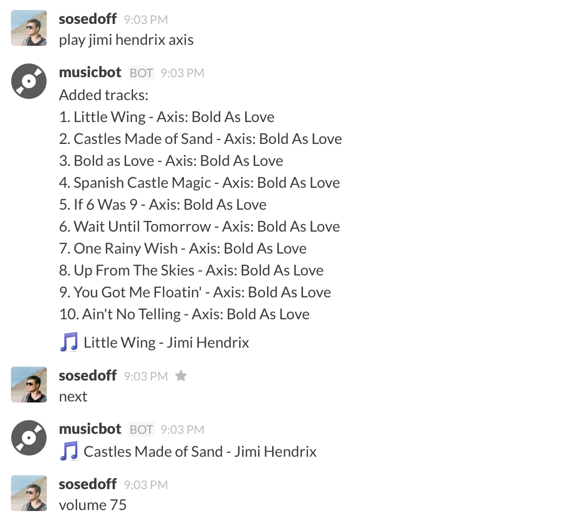

# MusicBot

Play music from Slack: Raspberry Pi + Mopidy + Spotify

## What is this?

This is a bot to control music playback via Slack channel. It communicates commands
from users to a Mopidy server via JSON RPC endpoint. Mopidy makes it possible to
use Spotify as a media source, but you would need a premium account ($10/mo).

## How does it work?

Users in Slack can control playlist: add new tracks, skip, pause, stop and control
volume. Musicbot will send notification when next track starts playing or when 
new tracks are added to the playlist.

Mopidy is a very flexible media streaming solution that works fine on all major
systems including Raspberry PI. Even an old RPi model A with 256 Mb RAM should be 
good enough. Musicbot itself has a very small memory footprint and is distributed
as a precompiled binary.

## Commands

List of all available commands:

- `help`                     - Show help usage
- `current`                  - Get current track
- `next|skip`                - Skip to the next track
- `pause`                    - Pause playback
- `resume`                   - Resume playback
- `stop`                     - Stop playback
- `play`                     - Play current track 
- `play query`               - Play first 10 tracks that match query
- `tracks|lists`             - Get tracks in the playlist
- `clear`                    - Remote all tracks from playlist
- `vol|volume`               - Get current volume
- `vol|volume (up|down|num)` - Change volume